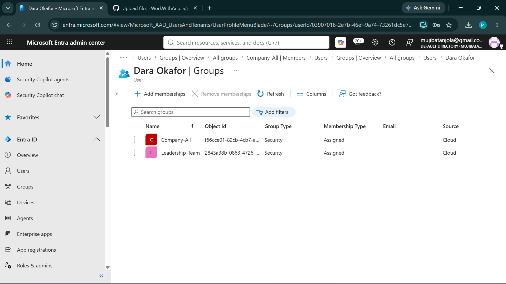
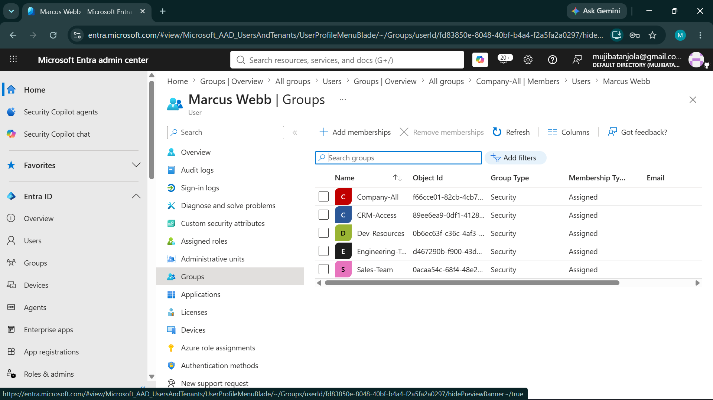
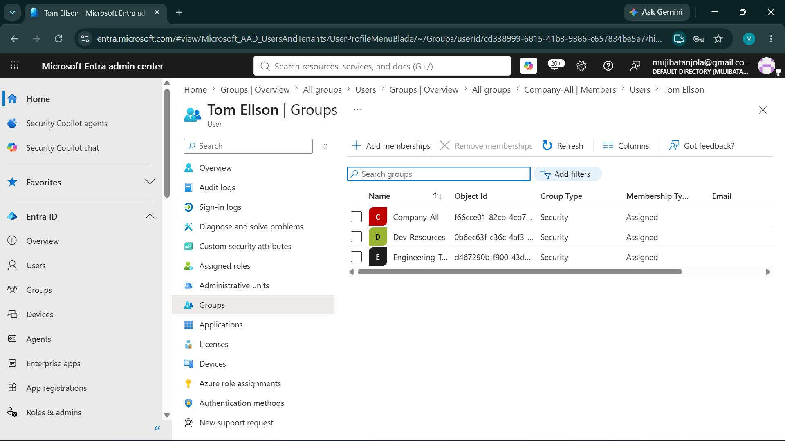
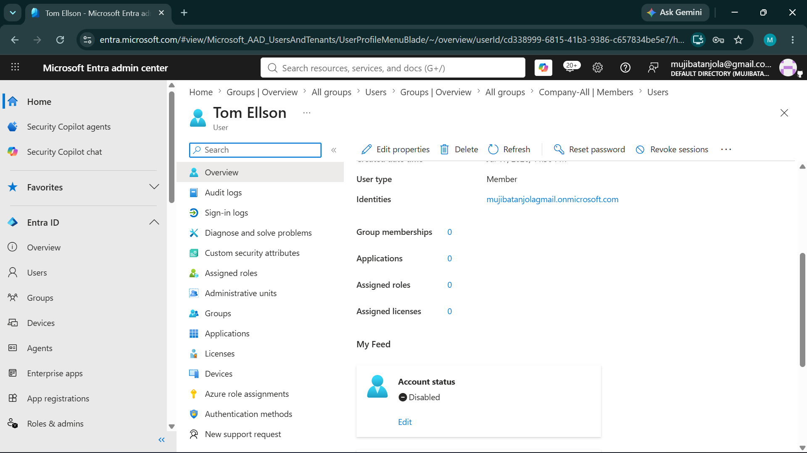
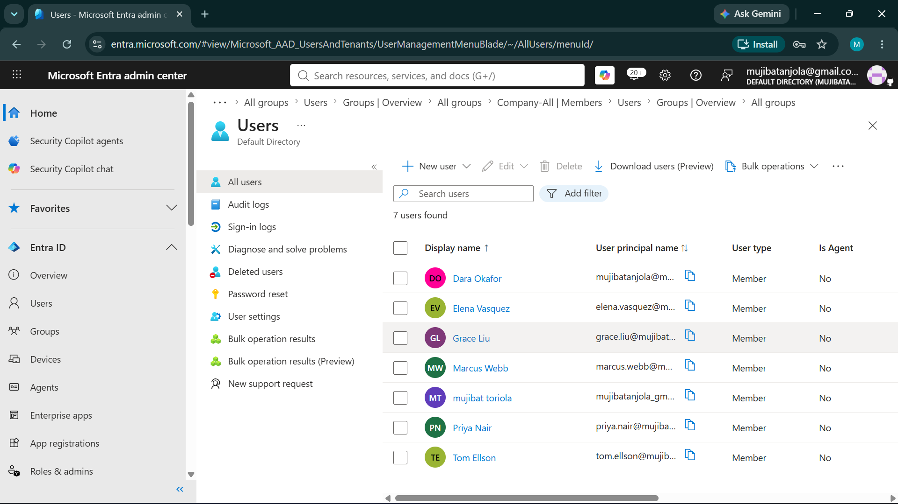

# Identity Lifecycle (JML) Audit Report — Brightleaf Consulting

**Prepared by:** Toriola Anjolaoluwa
**Platform audited:** Microsoft Entra ID
**Audit period:** July 2026
**Scope:** Joiner, Mover, and Leaver identity lifecycle events for a simulated 6person organization

---

## 1. Executive Summary

This audit simulated three core identity lifecycle events; a new hire (Joiner), an internal department transfer (Mover), and an employee departure (Leaver) - within a Microsoft Entra ID tenant, to evaluate whether access provisioning and deprovisioning practices align with the principle of least privilege and timely account management.

The audit found that **new user provisioning was handled correctly**, but identified two significant gaps in the **mover** and **leaver** processes: an internal transfer left prior department access intact rather than removing it, and account deactivation following departure was delayed well beyond a reasonable window. Both findings represent common, realistic identity governance failures and are mapped to NIST SP 800-53 control **AC-2 (Account Management)** below.

**Overall audit result: 2 findings requiring remediation — Medium risk.**

---

## 2. Scope & Methodology

A fictional 6 person organization ("Brightleaf Consulting") was created in Entra ID across four departments (Leadership, Finance, Engineering, Sales), each with department specific security groups controlling access to representative resources (e.g., Payroll SharePoint, Dev Resources, CRM Access). A baseline "before" state was documented for all users, after which three lifecycle events were simulated and audited against expected outcomes:

| Event | Simulated Scenario |
|---|---|
| **Joiner** | New Sales hire (Elena Vasquez) onboarded with department-appropriate access |
| **Mover** | Existing Engineering employee (Marcus Webb) transferred to Sales |
| **Leaver** | Existing Engineering employee (Tom Ellison) departed the company |

Each event was audited by comparing the user's actual final group memberships and account status against what their new role should require.

---

## 3. Findings

### Finding 1  Joiner Provisioning: No Issues Found ✅

**User:** Elena Vasquez (new Sales hire)
**Result:** Correctly assigned to Sales-Team, CRM-Access, and Company-All only — matching her role exactly, with no excess access granted.
**Risk:** None. Included as a positive control example.

---

### Finding 2  Mover Transfer: Prior Access Not Revoked 🔴 (High)

**User:** Marcus Webb (Engineering → Sales transfer)
**Observed:** Following his internal transfer, Marcus retained his original **Engineering-Team** and **Dev-Resources** group memberships in addition to his new **Sales-Team** and **CRM-Access** assignments. His final state included all five groups simultaneously.

**Why this matters:** Marcus now holds standing access to internal engineering tooling and resources despite no longer working in that department. This is one of the most common realworld identity gaps, provisioning new access during a transfer is usually handled promptly (often by IT or a manager request), while *removing* old access is frequently missed because no single step in most offboarding from old role workflows explicitly triggers it.

**Risk if unaddressed:** Unnecessary standing access increases the organization's attack surface — a compromised account or insider risk scenario now has a broader blast radius than the employee's actual current role requires. This directly violates the principle of least privilege.

**NIST SP 800-53 mapping:** **AC-2(g)**  accounts must be monitored and access modified in a timely manner when a user's role changes.

---

### Finding 3  Leaver Deprovisioning: Delayed Account Deactivation 🔴 (High)

**User:** Tom Ellison (departure)
**Observed timeline:**
| Event | Date |
|---|---|
| Last working day | July 25, 2026 |
| HR/IT notified | July 25, 2026 |
| Account disabled & access removed | July 31, 2026 |

**Gap:** **6 days** between departure and full account deactivation.

**Why this matters:** During this window, Tom's account remained active with full access to Engineering-Team and Dev-Resources resources despite no longer being an employee. Whether this delay stems from a manual, checklist-driven offboarding process or a missed notification step, the outcome is the same: an unnecessary window where a departed employee's credentials could be used — by the former employee or anyone who obtained their credentials — without legitimate business justification.

**Risk if unaddressed:** Delayed deprovisioning is a well documented root cause in insider threat and post-termination access incidents. Even a short window is a meaningful exposure for accounts with access to sensitive systems.

**NIST SP 800-53 mapping:** **AC-2(g), AC-2(3)**  accounts must be disabled immediately (not eventually) upon termination or transfer of an individual.

---

## 4. Risk Summary

| Finding | Severity | Status |
|---|---|---|
| Joiner provisioning (Elena Vasquez) | None | ✅ Passed |
| Mover — leftover access (Marcus Webb) | High | 🔴 Open |
| Leaver — delayed deactivation (Tom Ellison) | High | 🔴 Open |

---

## 5. Recommendations

**Immediate remediation:**
- Remove Marcus Webb's Engineering-Team and Dev-Resources group memberships, retaining only his current Sales-appropriate access.
- Review whether any other transferred employees carry similar leftover access from prior roles.

**Process-level recommendations (beyond this audit):**
- **Automate deprovisioning triggers**  tie account disablement directly to an HR system's termination date field, rather than relying on a manual, multi-day offboarding checklist. Same-day or next-business-day disablement should be the standard, not an eventual outcome.
- **Build a "role change" checklist that explicitly includes removal**  most transfer processes focus on granting new access; a formal step (and sign-off) confirming *removal* of prior role's access should be mandatory, not optional.
- **Run a recurring access recertification** (e.g., quarterly)  periodic manager sign-off on each employee's current group memberships would catch drift like Marcus's leftover access even if the initial transfer process fails to.
- **Track time-to-deprovision as a metric**  measuring and reporting on the gap between departure date and account disablement creates accountability and visibility for what is otherwise an invisible process failure.

---

## 6. Evidence

**Baseline — Dara Okafor (example of standard starting access)**

**Joiner — Elena Vasquez (clean, role-appropriate access)**

**Mover — Marcus Webb (leftover access from prior role, Finding 2)**

**Leaver — Tom Ellison, before departure (active access)**

**Leaver — Tom Ellison, after offboarding (disabled, Finding 3)**

**Final roster — all 7 users, final state**

*(Screenshots referenced above are included in the `/screenshots` folder of this repository.)*

---

## 7. Conclusion

This audit demonstrates that identity lifecycle risk rarely originates from the *creation* of new accounts that step is usually well controlled but instead from the *transitions*: transfers and departures, where removing access is easy to overlook because no single owner is explicitly accountable for it. Both findings in this audit are common, realistic patterns seen in real organizations, and both map to a well-established control (NIST SP 800-53 AC-2) that most compliance frameworks already require. Closing this class of gap is less about better security tooling and more about ensuring an existing process has an explicit, accountable last step.
